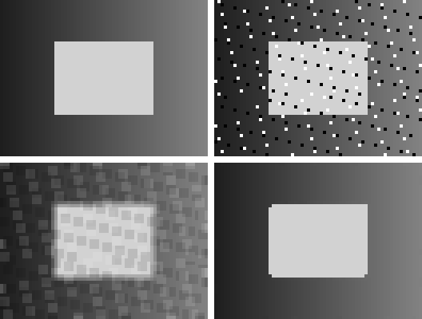

# CUDA C++ 开发指导书

面向有基本 C++ 知识、没有 CUDA 经验的读者。第一版共 10 章，从首次 GPU 计算逐步进入通用工程、图像处理、AI 算子、科学计算和多 GPU。正文使用中文，文件与目录使用英文，每章集中存放正文、完整源码和验证记录。

## 章节导航

| 章节 | 内容 | 验证状态 |
| --- | --- | --- |
| [第 1 章：认识 CUDA，准备实验环境](chapters/ch01-getting-started/README.md) | 环境、设备查询、数组加法 | CPU 对照通过 |
| [第 2 章：线程、下标与二维数据](chapters/ch02-thread-indexing/README.md) | 一维步长循环、二维下标与边界 | CPU 对照通过 |
| [第 3 章：内存访问与块内同步](chapters/ch03-memory-and-synchronization/README.md) | 直接转置、共享内存、屏障 | CPU 对照通过 |
| [第 4 章：工程组织、错误处理与性能测量](chapters/ch04-engineering-and-timing/README.md) | RAII、错误检查、预热与两种计时 | CPU 对照通过 |
| [第 5 章：图像滤波与去噪](chapters/ch05-image-filtering/README.md) | 均值、中值、边界、效果图与 MSE | CPU 对照通过 |
| [第 6 章：插值与几何变换](chapters/ch06-image-resampling/README.md) | 最近邻、双线性、缩放、平移 | CPU 对照通过 |
| [第 7 章：图像处理流水线](chapters/ch07-image-pipeline/README.md) | 设备中间结果、算子融合、双槽多帧 | CPU 对照通过 |
| [第 8 章：AI 算子：矩阵乘法与 Softmax](chapters/ch08-ai-operators/README.md) | 直接矩阵乘法、稳定 Softmax、归约 | CPU 对照通过 |
| [第 9 章：科学计算：二维热扩散](chapters/ch09-scientific-computing/README.md) | 显式热扩散、双缓冲、稳定性与误差 | CPU 对照通过 |
| [第 10 章：多 GPU：任务划分与结果汇总](chapters/ch10-multi-gpu/README.md) | 分片、设备归属、主机汇总 | 单卡通过；双卡跳过 |

各章包含小规模手算、最小与递进示例、常见错误、练习与参考答案。完整代码位于章节 examples/，正文链接到它们；公共依赖也随仓库提供。

## 项目结构

```text
cuda-guide/
  README.md
  CMakeLists.txt
  .gitignore
  common/
    cuda_support.cuh
    image_support.hpp
  chapters/
    ch01-getting-started/
      README.md
      examples/
      results/
    ch02-thread-indexing/
    ...
    ch10-multi-gpu/
  scripts/
    render_images.py
  results/
    validation.md
  build/                       # Git 忽略的本机构建产物
```

## 一次构建全书

以下命令针对当前实测服务器；全部从项目根目录运行：

```bash
cd /data2/cuda-guide
cmake -S . -B build/all \
  -DCMAKE_CUDA_COMPILER=/home/zhangyukai/.local/cuda/bin/nvcc \
  -DCMAKE_CUDA_ARCHITECTURES=120 \
  -DCMAKE_BUILD_TYPE=Release
cmake --build build/all -j2
ctest --test-dir build/all --output-on-failure
```

本机 GPU 为 RTX 5060 Ti（计算能力 12.0），驱动 595.84，nvcc 12.8.93，GCC 13.3.0，CMake 3.28.3。nvcc 未加入默认 PATH，因此使用绝对路径。其他机器需重新选择工具路径与目标架构。没有自动安装或升级驱动、CUDA 或依赖。

当前统一验证：11 项通过，1 项因没有第二块 GPU 跳过，0 项失败。不能把 CTest 的“100% tests passed”解释成双卡也通过。详情见 [全书验证记录](results/validation.md) 和各章 results/validation.md。

## 图像结果

第 5、6、7 章保存了实际图像效果与数值验证，第 9 章也保存了温度场。PGM 为量化像素，SVG 为逐像素可视化，PNG 为便于预览的四倍最近邻显示图。CPU/GPU 误差在量化前计算。

下面按左上、右上、左下、右下显示干净参考、加噪输入、均值输出、中值输出：



图像来自确定性合成输入，不依赖外部图片。当前样例的噪声 MSE 为 1513.018421，均值后 282.997097，中值后 18.025412；不作为普遍算法排名。

程序的默认输出或正文命令输出位于 build/，不会覆盖归档图。需要从归档 PGM 重新生成 PNG 时，运行：

```bash
python3 scripts/render_images.py
```

该脚本仅使用 Python 标准库；编译和运行 CUDA 示例本身不需要 Python。

## 范围、来源与尚未验证的部分

原始 38 章大纲现已同步到 [outline.md](outline.md)，校验值与本机源文件一致。当前 10 章为先前形成的压缩初版，章节安排与原大纲不一致；后续编写以原大纲为依据。当前工作目录未发现适用的 AGENTS.md。

本版是完整的入门应用学习路径，不是所有 CUDA 技术的百科。共享内存和归约已有示例；Tensor Core、cuBLAS/cuDNN 集成、一般仿射旋转、P2P、NCCL/MPI 只保留适用的扩展说明，没有冒充实现或实测。

本机未找到 Compute Sanitizer、cuda-gdb、nsys、ncu，因此没有内存/同步工具通过结论或 profiler 并发证明。只有一块可见 GPU，双卡路径、设备间通信和多卡性能未验证。性能实验仅第 4 章，明确区分 CUDA event 序列计时与端到端计时，含预热和重复。

通过 SSH 别名 zyk 连接到实际主机 ubuntu2404。环境记录保留真实主机名。

已初始化本地 Git 仓库；未建立远程仓库。已有的 .vscode/、README.html 保留，不属于本次新增教材内容。

## 技术参考

示例为本项目自行编写。特定 API 与工具说明在相关章节中链接官方资料：

- [CUDA C++ Programming Guide 12.8](https://docs.nvidia.com/cuda/archive/12.8.0/cuda-c-programming-guide/index.html)
- [CUDA C++ Best Practices Guide 12.8](https://docs.nvidia.com/cuda/archive/12.8.0/cuda-c-best-practices-guide/index.html)
- [Compute Sanitizer](https://docs.nvidia.com/compute-sanitizer/ComputeSanitizer/index.html)
