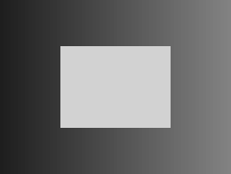
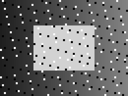
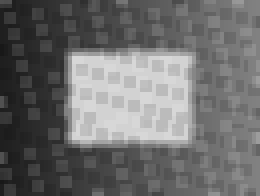
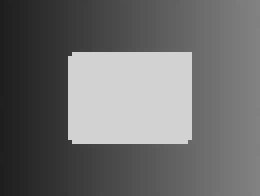

# 第 5 章：图像滤波与去噪

[全书导航](../../README.md) · [上一章](../ch04-engineering-and-timing/README.md) · [下一章](../ch06-image-resampling/README.md)

## 1. 一颗白点为什么让均值失真

考虑一个 3×3 邻域，八个像素为 10，中心被噪声变成 255。均值为 (8×10+255)/9=37.222…；排序后第 5 个数仍是 10。前者就是 3×3 均值滤波，后者是 3×3 中值滤波。

两者解决的问题不同：均值把邻域信息混合，可能模糊边缘；中值对孤立的极端像素较稳健，但也可能删除细小结构。不能从一个合成样例推出某方法适合所有噪声。

本章将这个手算例作为最小测试，再对一张 65×49 的确定性合成灰度图加入椒盐噪声，完成 GPU 滤波、CPU 验证和效果图保存。图像无需外部文件或图像库，第一次构建即可复现。

## 2. 先定义图像和边界

本章图像是单通道 float，行优先连续存储，像素范围约为 0 到 255。width 表示每行元素数；这里没有额外的行填充。如果未来读取带 stride 的图像，地址公式必须使用实际行跨度，不能默认为 width。

3×3 窗口读到边界之外时采用 clamp：把坐标夹到最近边界。左上角的 (-1,-1)、(0,-1)、(-1,0) 都映射到 (0,0)。边界策略是算法的一部分，CPU 与 GPU 必须一致；零填充、镜像和周期边界会给出不同结果。

窗口始终有九个值，包括 clamp 产生的重复样本。因此均值总是除以 9。若只累计有效邻居而仍除以 9，边缘会变暗。

## 3. 最小示例：一个线程计算一个窗口

均值实现的主要步骤：

```cpp
float sum=0;
for(int dy=-1;dy<=1;++dy)
    for(int dx=-1;dx<=1;++dx)
        sum += input[clamp(y+dy)*width+clamp(x+dx)];
output[y*width+x]=sum/9;
```

上面的 clamp 是概念写法，完整源码明确写出上下界，可直接编译。它为每个输出读取九个值；邻居线程有重复读取，但这是容易理解的基准实现。

输入输出必须分离。原地滤波让线程一边读邻居一边覆盖输入，结果将依赖执行顺序。shared memory 优化可以减少重复加载，但必须为 tile 加载周围 halo，不能简单照搬第 3 章的转置代码。

## 4. 递进示例：中值去噪与 CPU 参考

GPU 中值实现将九个 float 放入线程局部数组，使用插入排序，取 values[4]。CPU 参考用 std::sort 排序 double 邻域，均值也使用 double 累加。采用不同的组织方式并保留手算案例，有助于避免两份程序复制同一个错误。

局部数组不是共享内存。编译器可能将其放在寄存器或局部内存中；本章没有 profiler 数据，不声称这种排序最高效。它足够小、完整，适合解释数值语义。

测试覆盖 1×1、3×3、65×49。浮点比较容差为 atol=3e-5、rtol=1e-6。实际最大均值误差约 6.78e-6，中值误差为 0。3×3 中心实际输出为 37.222221 和 10.000000，符合手算及 float 舍入。

## 5. 看图，也看数字

以下 SVG 直接由实际像素生成；旁边同名 PGM 保存灰度字节。显示时四倍放大，未添加平滑。数值验证在保存前对 float 完成，不把图片量化误差混入 GPU 验证。

| 干净参考 | 加噪输入 |
| --- | --- |
|  |  |
| 均值输出 | 中值输出 |
|  |  |

误差分为两类：

- GPU 对 CPU 参考误差，回答“实现是否计算了指定滤波”。
- 输出对干净图的 MSE，回答“这个样例的去噪效果怎样”。

MSE=(1/N)Σ(output-clean)²。本次输入 MSE 为 1513.018421，均值输出为 282.997097，中值输出为 18.025412。这些值来自日志，不是普遍指标。中值在这张图上更接近参考，但效果图也显示边角或细节可能改变。换成高斯噪声或细线图案，结果需要重新实验。

合成图包含灰度渐变和亮矩形，噪声位置由整数公式固定。保存图像的代码在 [image_support.hpp](../../common/image_support.hpp)，不依赖随机种子、网络下载或外部图像包。

## 6. 常见错误

- 输入输出共用缓冲区，引入相邻线程的数据竞争。
- 用 unsigned char 先累加九个像素，溢出后才转成 float。
- GPU 使用 clamp，CPU 使用零填充，误以为边缘差异是浮点误差。
- 只凭图片看起来平滑就认定数值正确。
- 将中值滤波称作线性卷积；中值包含排序，不满足线性叠加。
- 将一个 MSE 改善样例写成所有图像的算法排名。

## 7. 练习与参考答案

1. 九个像素都是 80，均值和中值是多少？
   答：均为 80；夹边策略也应保持常量图。
2. 邻域 [0,0,0,0,255,255,255,255,255] 的中值是多少？
   答：255。多数值已被改变时，中值不能恢复原值。
3. 能用两个一维均值滤波得到 3×3 均值吗？
   答：在一致的边界策略及足够精度下，可以先水平三点再垂直三点，权重为 1/9；中间不能过早量化。中值不具备同样的可分离性质。
4. 添加一张常量 80 的测试图，应检查什么？
   答：所有输出保持 80，特别是四角；这是练习扩展，当前实测清单见日志。

## 构建、运行与实测输出

完整源码：[filtering.cu](examples/filtering.cu)；构建定义：[CMakeLists.txt](examples/CMakeLists.txt)。公共依赖也在本仓库，不需要复制未提供的代码。

在项目根目录执行（首次配置后可重复构建）：

```bash
cd /data2/cuda-guide
cmake -S . -B build/all \
  -DCMAKE_CUDA_COMPILER=/home/zhangyukai/.local/cuda/bin/nvcc \
  -DCMAKE_CUDA_ARCHITECTURES=120 -DCMAKE_BUILD_TYPE=Release
cmake --build build/all --target filtering -j2
./build/all/ch05/filtering build/ch05-images
```

也可单独配置本章：把上面 -S 改为 chapters/ch05-image-filtering/examples，-B 改为 build/ch05-standalone，其他选项不变；程序位于该独立构建目录下。无需第三方图像或数学库。

本次实际输出如下。除计时数据可能随运行波动外，同一固定输入应得到这些结果或在注明容差内一致；最终错误数量应为 0：

```text
box3: n=1 max_abs_error=0 mismatches=0 PASS
median3: n=1 max_abs_error=0 mismatches=0 PASS
box3: n=9 max_abs_error=8.47710503e-07 mismatches=0 PASS
center_box=37.222221
median3: n=9 max_abs_error=0 mismatches=0 PASS
center_median=10.000000
box3: n=3185 max_abs_error=6.78168402e-06 mismatches=0 PASS
box MSE_to_clean=282.997097 (noisy=1513.018421)
median3: n=3185 max_abs_error=0 mismatches=0 PASS
median MSE_to_clean=18.025412 (noisy=1513.018421)
```

运行命令将效果图写入 build/ 下，避免覆盖归档结果；正文引用的实测图已保存在 results/images/。SVG 和 PGM 均为程序生成。

更多环境与限制见 [validation.md](results/validation.md)。本机没有 Compute Sanitizer，不能把 CPU 对照通过等同于内存或同步工具检查通过。
