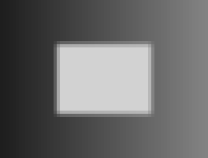

# 第 6 章：插值与几何变换

[全书导航](../../README.md) · [上一章](../ch05-image-filtering/README.md) · [下一章](../ch07-image-pipeline/README.md)

## 1. 一个不在像素中心的位置应取什么值

输入 2×2 小图：

```text
 0  10
20  30
```

要在 (x=0.25,y=0.5) 取值。先沿 x 方向：上行 0×0.75+10×0.25=2.5，下行 20×0.75+30×0.25=22.5。再沿 y 方向各取一半，得到 12.5。这就是双线性插值的一个完整手算例，本章 GPU 最小测试实际输出 12.500000。

最近邻则直接选最近的像素，边界和恰好一半时的取整规则要明确。源码采用 floor(coord+0.5)，在这个坐标会选 (0,1)，值为 20。该最近邻手算用于解释规则，不是 tiny_bilinear 那项测试的输出。

## 2. 几何变换先回答“输出从哪里取样”

如果让每个输入像素向前投射到输出，放大时可能留下空洞，多个输入也可能争写同一个输出。这里采用反向映射：每个输出像素找到输入坐标，再插值读取；每个输出只有一个写入者。

本章实现轴向缩放与平移：

```text
input_x = sx * output_x + tx
input_y = sy * output_y + ty
```

要把内容向右平移 5、向下平移 3，输入坐标应为 (x-5,y-3)。反向公式的负号很容易写错。超出输入范围时夹到边缘，所以平移后的空白位置会被边缘颜色延伸填充，不是黑边。

旋转与一般仿射变换也可用同样的反向采样框架，但需要包含 x、y 交叉项。本章已实现、验证的是缩放和平移，不把未实现的旋转或透视变换列作实测能力。

## 3. 最小示例：四个邻居及其权重

令 x0=floor(fx)、y0=floor(fy)、u=fx-x0、v=fy-y0。四个权重是：

| 邻居 | 权重 |
| --- | --- |
| (x0,y0) | (1-u)(1-v) |
| (x0+1,y0) | u(1-v) |
| (x0,y0+1) | (1-u)v |
| (x0+1,y0+1) | uv |

权重和为 1。坐标已经夹到有效范围，x1 与 y1 也需夹边，才能处理宽度或高度只有 1 的图像。程序实际测试 1×1 图放大到 3×2，所有结果仍为 17。

GPU 通过两次线性混合计算，CPU double 参考通过四项权重求和计算。本例使用的坐标比例为 0.5，测试图数值也容易表示；本次误差为 0，不意味着任意插值都能做到位级相同。比较采用 atol=1e-4、rtol=1e-6。

## 4. 递进示例：二倍放大的坐标约定

直接把输入坐标写成 x/2，与像素中心对齐约定并不等价。本章使用 half-pixel：

```text
input_x = (output_x + 0.5) * input_width / output_width - 0.5
```

二倍放大时化为 0.5*x-0.25。第一个输出对应 -0.25，夹边后为 0。另一个常见约定会对齐两端像素中心，两者不能混用。与图像库对照时先确认坐标约定、边界、取整和数据类型，再讨论误差。

本章将 33×25 放大到 66×50，分别使用最近邻和双线性；还验证原尺寸恒等变换，以及向右 5、向下 3 的平移。放大能平滑显示，却不会创造原图没有的真实细节。缩小时，仅双线性采样不保证抗混叠；应按任务设计低通预滤波。

## 5. 实际效果

| 输入 | 最近邻二倍放大 |
| --- | --- |
|  |  |
| 双线性二倍放大 | 平移（夹边） |
|  |  |

图像显示经过四倍逐像素放大，因此输出图在页面上更大；不要把页面尺寸变化误认为额外算法。PGM 和 SVG 都由该次 GPU 输出生成。CPU 参考对每个输出像素逐项验证，效果图用于帮助观察边缘变化。

## 6. 常见错误

- 把正向平移位移直接代入反向采样公式，内容移动方向相反。
- 使用整数除法计算缩放系数，比例被截断。
- 忘记对 x1、y1 夹边，最后一列或单像素图越界。
- 用 bilinear 缩小高频纹理却不考虑抗混叠。
- 与外部库比较时忽略 half-pixel 与端点对齐差异。
- 提前把插值结果转成字节，使 CPU 对照掺入不同的舍入规则。

## 7. 练习与参考答案

1. 对 2×2 小图在 (0.5,0.5) 采样，结果是什么？
   答：15，四个权重都是 1/4。
2. 内容要向左移动 4，反向映射 tx 是多少？
   答：+4，输出位置从右边的输入读取。
3. 双线性插值后值会超出四个样本的最小最大值吗？
   答：在 u、v 位于 [0,1] 且权重非负时不会；数值计算可能有微小舍入误差。
4. 一般仿射映射怎样增加旋转？
   答：使用 input_x=a00*x+a01*y+a02、input_y=a10*x+a11*y+a12，并先计算目标变换的逆矩阵。必须再增加可手算的 90° 旋转测试；当前源码未实现这一扩展。

## 构建、运行与实测输出

完整源码：[resampling.cu](examples/resampling.cu)；构建定义：[CMakeLists.txt](examples/CMakeLists.txt)。公共依赖也在本仓库，不需要复制未提供的代码。

在项目根目录执行（首次配置后可重复构建）：

```bash
cd /data2/cuda-guide
cmake -S . -B build/all \
  -DCMAKE_CUDA_COMPILER=/home/zhangyukai/.local/cuda/bin/nvcc \
  -DCMAKE_CUDA_ARCHITECTURES=120 -DCMAKE_BUILD_TYPE=Release
cmake --build build/all --target resampling -j2
./build/all/ch06/resampling build/ch06-images
```

也可单独配置本章：把上面 -S 改为 pilot/ch06-image-resampling/examples，-B 改为 build/ch06-standalone，其他选项不变；程序位于该独立构建目录下。无需第三方图像或数学库。

本次实际输出如下。除计时数据可能随运行波动外，同一固定输入应得到这些结果或在注明容差内一致；最终错误数量应为 0：

```text
tiny_bilinear: n=1 max_abs_error=0 mismatches=0 PASS
tiny_bilinear_value=12.500000
singleton: n=6 max_abs_error=0 mismatches=0 PASS
identity: n=825 max_abs_error=0 mismatches=0 PASS
nearest: n=3300 max_abs_error=0 mismatches=0 PASS
bilinear: n=3300 max_abs_error=0 mismatches=0 PASS
translated: n=825 max_abs_error=0 mismatches=0 PASS
```

运行命令将效果图写入 build/ 下，避免覆盖归档结果；正文引用的实测图已保存在 results/images/。SVG 和 PGM 均为程序生成。

更多环境与限制见 [validation.md](results/validation.md)。本机没有 Compute Sanitizer，不能把 CPU 对照通过等同于内存或同步工具检查通过。
